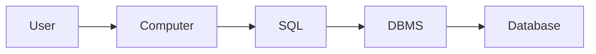

# Types of Databases

1. Relational (SQL)
2. Document (MongoDB)
3. Key Value (DynamoDB)
4. Graph (Neo4j)
5. Wide Columnar

# Databases + SQL Fundamentals

## Query

```sql
SELECT *
FROM USERS
```

## Imperative and Declarative

- Imperative: How it will happen?

  - go line by line of instruction to tell exactly what we want program to do
  - Java, Python
  - more flexible bit more complicated

- Declarative: What will happen?
  - more abstract. we just say "give me this"
  - simple but less flexible
  - SQL, Python
  - Python can be both imperative and declarative

## What is SQL?



- SQL (Structured Query Language) is abstract layer of DBMS (database management) and database
- Each DBMS have their own model

## Database model

- A way to organize and store data
- e.g., Hierarchical, Networking, Entity-Relationship, Relational \*\* (most popular), Object Oriented, Flat, Semi-Structured etc.

### Hierarchical model

- Old database model used by IBM in the 60s and 70s
- Not popular anymore due to inefficiencies
- tight coupling (child node depend on parent node)
- support for one-to-many relationship


- Example in XML

```xml
<Author>
  <Mo>
    <Name>Mo Binni</Name>
    <Country>Canada</Country>
    <Book1>
      <Released>01/01/1990</Released>
    </Book1>
    <Book2>
      <Released>01/01/1993</Released>
    </Book2>
  </Mo>
    <Name>Andrei Neagoie</Name>
    <Country>Canada</Country>
    <Book1>
      <Released>01/01/1990</Released>
    </Book1>
    <Book2>
      <Released>01/01/1993</Released>
    </Book2>
</Author>
```

### Network model

- expanded on the hierarchical model allowing many-to-many relationship


- Example in XML

```xml
<Author>
  <Mo>
    <Name>Mo Binni</Name>
    <Country>Canada</Country>
    <Book1 author="Andrei" relation="co-author" />
    <Book2>
      <Released>01/01/1993</Released>
    </Book2>
  </Mo>
    <Name>Andrei Neagoie</Name>
    <Country>Canada</Country>
    <Book1>
      <Released>01/01/1990</Released>
    </Book1>
    <Book2>
      <Released>01/01/1993</Released>
    </Book2>
</Author>
```

### Relational Model


## DBMS

- CRUD operations
- Manage data, Secure data, Transaction data
- e.g., Microsoft SQL Server, IBM, MySQL, Oracle, PostgreSQL
- 12 rules of CODD (https://www.w3resource.com/sql/sql-basic/codd-12-rule-relation.php)

## Relational Model

- Relation Schema
- Attribute
- Degree
- Cardinality
- Tuple
- Column
- Relation Key
- Domain
- Tables
- Relation Instance

### Tables

- Example


### Columns

- Column / Attribute = one column
- Degree = Many columns
- Domain / Constraint = limitation on data type in a column
  - dob can store datetime
  - sex can store 1 char 'm' or 'f'

### Rows

- Row / Tuple
- Cardinality = many row

### Primary Key

- primary key : uniquely identify data
- foreign key : primary key of the different table

## OLTP vs OLAP

- OLTP (Online Transaction Processing): support day to day
- OLAP (Online Analytical Processing): support analysis

# SQL Deep Dive

## SQL Commands

- DCL (Data Control Language) : `GRANT`, `REVOKE`
- DDL (Data Definition Language) : `CREATE`, `ALTER`, `DROP`, `RENAME`, `TRUNCATE`, `COMMENT`, ``
- DQL (Data Query Language) : `SELECT`
- DML (Data Modification Language) : `INSERT`, `UPDATE`, `DELETE`, `MERGE`, `CALL`, `EXPLAIN PLAN`, `LOCK TABLE`
