Skills: `SQL`, `PostgreSQL`, `Database`, `ER Diagram`

# Types of Databases

1. Relational (SQL)
2. Document (MongoDB)
3. Key Value (DynamoDB)
4. Graph (Neo4j)
5. Wide Columnar

# Databases + SQL Fundamentals

## Query

```sql
SELECT *
FROM USERS
```

## Imperative and Declarative

- Imperative: How it will happen?

  - go line by line of instruction to tell exactly what we want program to do
  - Java, Python
  - more flexible bit more complicated

- Declarative: What will happen?
  - more abstract. we just say "give me this"
  - simple but less flexible
  - SQL, Python
  - Python can be both imperative and declarative

## What is SQL?

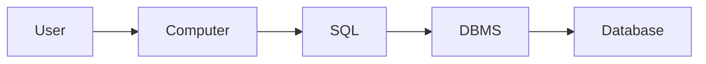
```mermaid
flowchart LR
    User-->Computer
    Computer-->SQL
    SQL-->DBMS
    DBMS-->Database
```

- SQL (Structured Query Language) is abstract layer of DBMS (database management) and database
- Each DBMS have their own model

## Database model

- A way to organize and store data
- e.g., Hierarchical, Networking, Entity-Relationship, Relational \*\* (most popular), Object Oriented, Flat, Semi-Structured etc.

### Hierarchical model

- Old database model used by IBM in the 60s and 70s
- Not popular anymore due to inefficiencies
- tight coupling (child node depend on parent node)
- support for one-to-many relationship

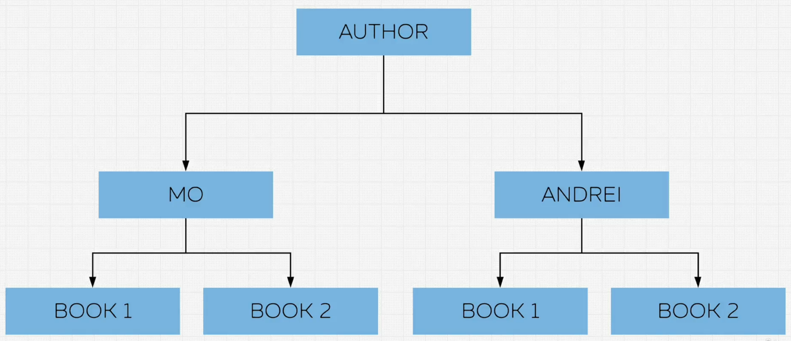

- Example in XML

```xml
<Author>
  <Mo>
    <Name>Mo Binni</Name>
    <Country>Canada</Country>
    <Book1>
      <Released>01/01/1990</Released>
    </Book1>
    <Book2>
      <Released>01/01/1993</Released>
    </Book2>
  </Mo>
    <Name>Andrei Neagoie</Name>
    <Country>Canada</Country>
    <Book1>
      <Released>01/01/1990</Released>
    </Book1>
    <Book2>
      <Released>01/01/1993</Released>
    </Book2>
</Author>
```

### Network model

- expanded on the hierarchical model allowing many-to-many relationship

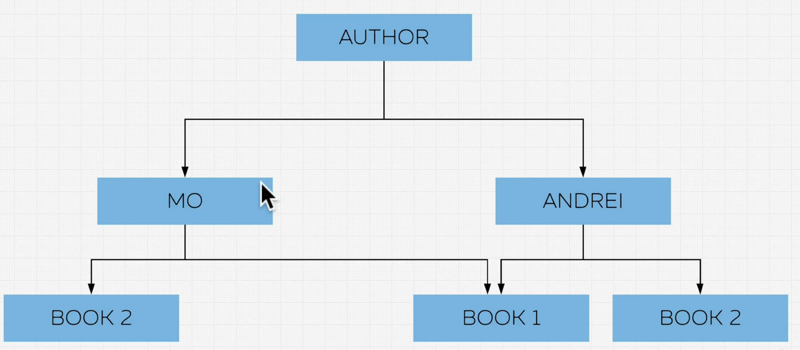

- Example in XML

```xml
<Author>
  <Mo>
    <Name>Mo Binni</Name>
    <Country>Canada</Country>
    <Book1 author="Andrei" relation="co-author" />
    <Book2>
      <Released>01/01/1993</Released>
    </Book2>
  </Mo>
    <Name>Andrei Neagoie</Name>
    <Country>Canada</Country>
    <Book1>
      <Released>01/01/1990</Released>
    </Book1>
    <Book2>
      <Released>01/01/1993</Released>
    </Book2>
</Author>
```

### Relational Model


```mermaid
flowchart LR
    Author-->Book
```

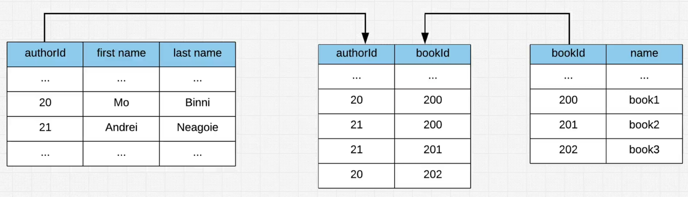

## DBMS

- CRUD operations
- Manage data, Secure data, Transaction data
- e.g., Microsoft SQL Server, IBM, MySQL, Oracle, PostgreSQL
- 12 rules of CODD (https://www.w3resource.com/sql/sql-basic/codd-12-rule-relation.php)

## Relational Model

- Relation Schema
- Attribute
- Degree
- Cardinality
- Tuple
- Column
- Relation Key
- Domain
- Tables
- Relation Instance

### Tables

- Example

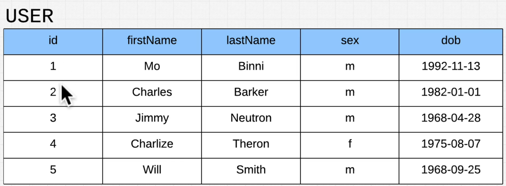

### Columns

- Column / Attribute = one column
- Degree = Many columns
- Domain / Constraint = limitation on data type in a column
  - dob can store datetime
  - sex can store 1 char 'm' or 'f'

### Rows

- Row / Tuple
- Cardinality = many row

### Primary Key

- primary key : uniquely identify data
- foreign key : primary key of the different table

## OLTP vs OLAP

- OLTP (Online Transaction Processing): support day to day
- OLAP (Online Analytical Processing): support analysis

# SQL Deep Dive

## SQL Commands

- DCL (Data Control Language) : `GRANT`, `REVOKE`
- DDL (Data Definition Language) : `CREATE`, `ALTER`, `DROP`, `RENAME`, `TRUNCATE`, `COMMENT`
- DQL (Data Query Language) : `SELECT`
- DML (Data Modification Language) : `INSERT`, `UPDATE`, `DELETE`, `MERGE`, `CALL`, `EXPLAIN PLAN`, `LOCK TABLE`

## Function in SQL

- Aggregate: operate many records to produce 1 value

  - `AVG()`, `COUNT()`, `MIN()`, `MAX()`, `SUM()`

- Scalar: operate on each record independently

  - `CONCAT`

## Filtering

- WHERE

## Logical Operator

- AND, OR, NOT

- Operation: >, <, <=, >=, =, !=

- Order of operations: FROM -> WHERE -> SELECT

- Operator Precedence (priority of operators) If same priority, operate (left to right) or (right to left)
  - Parentheses
  - Multiplication / Division
  - Subtraction / Addition
  - NOT
  - AND
  - OR

## Checking for empty value

- Null represent missing/empty value

- What ever we do with null, it always be null
- 1 = 1 (true), 1 != 1 (false)
- null = null (null), null <> null (null)

1. filter out null : use `is` instead of `!=`

```sql
SELECT * FROM <table>
WHERE <field> IS [NOT] NULL
```

2. replace null

```sql
SELECT COALESCE(<column>, 'Empty') AS column_alias
FROM <table>
```

```sql
SELECT COALESCE(<column1>, <column2>, <column3>, 'Empty') AS column_alias
FROM <table>
```

## 3-value logic

- Logical Expression in sQL can be TRUE, FALSE, UNKNOWN

## BETWEEN AND

```sql
SELECT <column>
FROM <table>
WHERE <column> BETWEEN x AND y
-- equivalent to
-- WHERE <column> >= X and <column> <= Y
```

## IN

```sql
SELECT *
FROM <table>
WHERE <column> IN (value1, value2)
-- equivalent to
-- WHERE <column> == value1 or <column> == value2
```

## LIKE

- partial lookup

```sql
SELECT first_name FROM employees
FROM first_name LIKE 'M%'
```

- `M%` : string start with M
- `%` : Any number of character
- `_` : 1 character
- Cast : changing something to something else
- must cast to text to use with like

```sql
CAST(salary as text);
salary::text
```

- case insensitive match

```sql
name ILIKE 'MO%'
```

- match string start with MO, Mo, mO. mo

## Date and Timezones

```sql
SET TIME ZONE 'UTC'
```

```sql
SHOW TIMEZONE
```

```sql
ALTER USER <username> SET timezone='UTC'
```

- POSTGRESQL uses ISO-8001 (format of date and time)
- `YYYY-MM-DDTHH:MM:SS`
- `2017-08-17T12:47:16+02.00`
- it is 12:47:16 o'clock at +02.00 time zone
- format is a way to represent date and time

- Timestamp is a date with time and timezone info

```sql
SELECT now()
```

- Get current date

```sql
SELECT now()::date;
SELECT CURRENT_DATE;
```

- Formatting date

```sql
SELECT TO_CHAR(CURRENT_DATE, 'dd/mm/yyyy');
```

- Date Different

```sql
SELECT now() - '1800/01/01';
```

- To date (cast string to date)

```sql
SELECT date '1800/01/01';
```

- Age

```sql
SELECT AGE(date '1800/01/01');
SELECT AGE(date '1992/11/13', date '1800/01/01');
```

- Extract

```sql
SELECT EXTRACT (DAY FROM date '1992/11/13') AS DAY;
SELECT EXTRACT (MONTH FROM date '1992/11/13') AS MONTH;
SELECT EXTRACT (YEAR FROM date '1992/11/13') AS YEAR;
```

- Rounding date: `year`, `month`, `week`, `day`

```sql
SELECT DATE_TRUNC ('year', date '1992/11/13');
```

- Interval

```sql
SELECT *
FROM orders
WHERE purchaseDate <= now() - INTERVAL '30 days'
```

```sql
SELECT EXTRACT (
  year
  FROM INTERVAL '5 years 20 months'
)
```

## DISTINCT

- distinct for combination of column

```sql
SELECT DISTINCT <col1>, <col2> FROM <table>;
```

## Sorting Data

- ASC is default

```sql
SELECT * FROM customers
ORDER BY <column1> [ASC/DESC], <column2> [ASC/DESC]
```

```sql
SELECT * FROM customers
ORDER BY length(first_name) DESC
```

## Multi Table SELECT

- inner join (using where)

```sql
SELECT  a.emp_no,
        CONCAT(a.first_name, a.last_name) as "name",
        b.salary
FROM employees as a, salaries as b
WHERE a.emp_no = b.emp_no
ORDER BY a.emp_no
```

- inner join (using join)

```sql
SELECT  a.emp_no,
        CONCAT(a.first_name, a.last_name) as "name",
        b.salary
FROM employees as a
[INNER] JOIN salaries as b ON b.emp_no = a.emp_no;
```

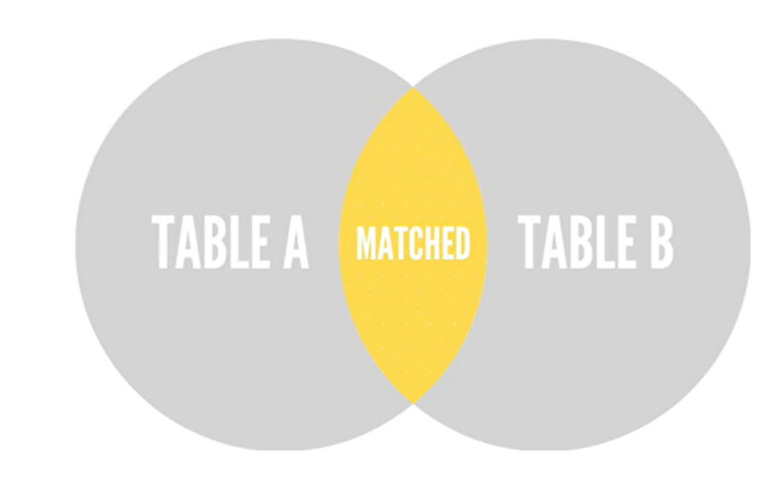

- self join
  - happen when a table has a foreign key referencing its primary key

| id  | name           | startDate  | supervisorId |
| --- | -------------- | ---------- | ------------ |
| 1   | Mo Binni       | 1990/01/13 | 2            |
| 2   | Andrei Neagoie | 1980/01/23 | 2            |

- self join using where

```sql
SELECT a.id, a.name as "employee", b.name as "supervisor name"
FROM employee as a, employee as b
WHERE a.supervisorId = b.id
```

- self join using inner join

```sql
SELECT a.id, a.name as "employee", b.name as "supervisor name"
FROM employee as a
INNER JOIN employee as b
ON a.supervisorId = b.id
```

- outer join

  - get also the row that don't match

- left outer join

```sql
SELECT *
FROM <table A> AS a
LEFT [OUTER] JOIN <table b> AS b
ON a.id = b.id
```

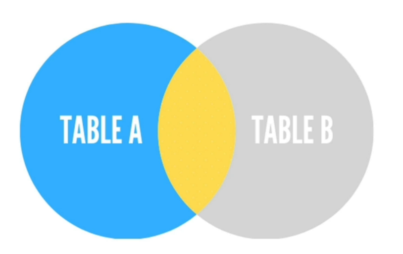

- right outer join

```sql
SELECT *
FROM <table A> AS a
RIGHT [OUTER] JOIN <table b> AS b
on a.id = b.id
```

- uncommon join

  - cross join : create a combination of every row (num row result = num row a \* num row b)
  - full outer join : create all key from both left and right tables
    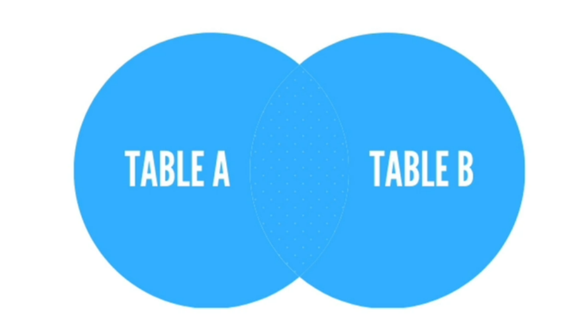

- USING key word

```sql
SELECT  a.emp_no,
        CONCAT(a.first_name, a.last_name) as "name",
        b.salary
FROM employees as a
INNER JOIN salaries as b USING(emp_no)
-- `USING(emp_no)` is same as `ON b.emp_no = a.emp_no`
```

# Advanced SQL

## GROUP BY

- every column not in the group-by clause must apply a function
- group by utilize split-apply-combine strategy

```sql
SELECT dept_no, COUNT(emp_no)
FROM dept_emp
GROUP BY dept_no
```

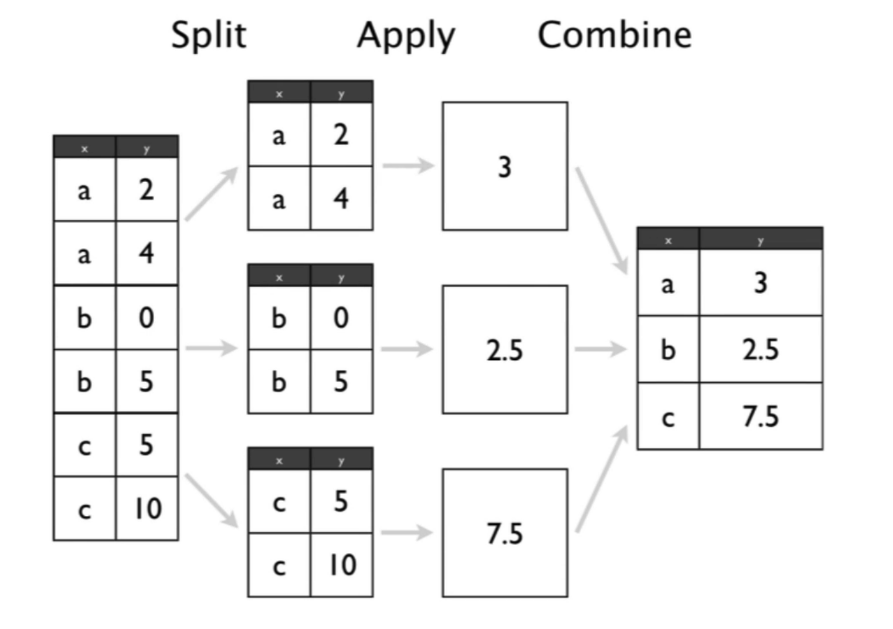

- Order of operation

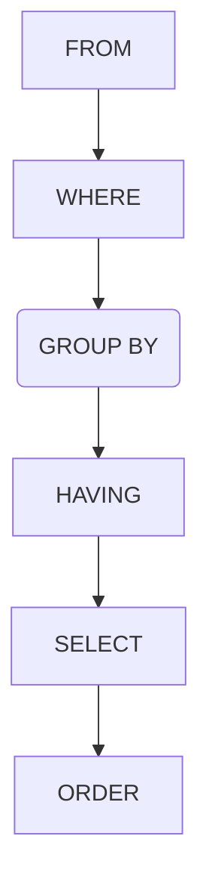
```mermaid
flowchart TB
    FROM-->WHERE
    WHERE-->groupby(GROUP BY)
    groupby(GROUP BY)-->HAVING
    HAVING-->SELECT
    SELECT-->ORDER
```

- filter on group (`WHERE` is occur before group-by. Thus, we need `HAVING` to filter on group)

```sql
SELECT col1, COUNT(col2)
FROM <table>
WHERE col2 > X
GROUP BY col1
HAVING col1 === Y;
```

- ORDER BY for group

```sql
SELECT d.dept_name, COUNT(e.emp_no) AS "# of employees"
FROM employees AS e
iNNER JOIN dept_emp AS de ON de.emp_no = e.emp_no
INNER JOIN departments AS d ON de.dept_no = d.dept_no
WHERE e.gender = 'F'
GROUP BY d.dept_name
-- HAVING count(e.emp_no) > 25000
ORDER BY "# of employees" DESC
```

- UNION

```sql
SELECT NULL AS "prod_id", SUM(ol.quantity)
FROM orderlines AS ol

UNION

SELECT prod_id AS "prod_id", sum(ol.quantity)
FROM orderlines AS ol
GROUP BY prod_id
ORDER BY prod_id DESC
LIMIT 5
```

- GROUP SET

```sql
SELECT prod_id AS "prod_id", sum(ol.quantity)
FROM orderlines AS ol
GROUP BY
  GROUPING SETS (
    (),
    (prod_id)
  )
ORDER BY prod_id DESC
LIMIT 5
```

- ROLLUP
  - return combination of group set in rollup

```sql
SELECT  EXTRACT (YEAR FROM orderdate) AS "year",
        EXTRACT (MONTH FROM orderdate) AS "month",
        EXTRACT (DAY FROM orderdate) AS "day",
        SUM(ol.quantity)
FROM orderlines AS ol
GROUP BY
    ROLLUP (
        EXTRACT (YEAR FROM orderdate),
        EXTRACT (MONTH FROM orderdate),
        EXTRACT (DAY FROM orderdate)
        ()
    )

-- apply `HAVING` to reduce number of output
HAVING  (EXTRACT (YEAR FROM orderdate) = 2004 OR EXTRACT (YEAR FROM orderdate) IS NULL) AND
        (EXTRACT (MONTH FROM orderdate) = 1 OR EXTRACT (MONTH FROM orderdate) IS NULL)
ORDER BY
    EXTRACT (YEAR FROM orderdate),
    EXTRACT (MONTH FROM orderdate),
    EXTRACT (DAY FROM orderdate)
```

## Window Functions

- Window functions crete a new column based on functions performed on a subset or "window" of the data

```sql
window_function(arg1, arg2, ...) OVER (
  [PARTITION BY partition_expression]
  [ORDER BY sort_expression [ASC | DESC] [NULLS {FIRST | LAST}]]
)
```

### PARTITION BY keyword

- PARTITION BY: divide rows into groups to apply the function against (optional)

### ORDER BY Keyword

- ORDER BY: order the results
- order by change the frame of window function (to cumulative)

### Frame Clause

- When using a frame clause in a window function we can create a sub-rance or frame

| Key                            | Meaning                                            |
| ------------------------------ | -------------------------------------------------- |
| ROWS or RANGE                  | Whether you want to use a range or rows as a frame |
| PRECEDING                      | Rows before the current one                        |
| FOLLOWING                      | Rows after the current one                         |
| UNBOUND PRECEDING or FOLLOWING | Returns all before or after                        |
| CURRENT ROW                    | Your current row                                   |

```sql
PARTITION BT category ORDER BY price RANGE BETWEEN UNBOUND PRECEDING AND CURRENT ROW
```

- without `ORDER BY` by default the framing is usually all partition rows

## Functions

| Function        | Purpose                                                               |
| --------------- | --------------------------------------------------------------------- |
| SUM/MIN/MAX/AVG | Get the sum/min/max/avg of all records in the partition               |
| FIRST_VALUE     | Return a value evaluated against the first row within its partition   |
| LAST_VALUE      | Return a value evaluate against the last row within its partition     |
| NTH_VALUE       | Return a value evaluated against the nth row in an ordered partition  |
| PERCENT_RANK    | Return the relative rank of the current row (rank-1) / (total rows-1) |
| RANK            | Rank the current row within its partition with gaps                   |
| ROW_NUMBER      | Number the current row within its partition starting from 1           |
| LAG/LEAD        | Access values from the previous or next row                           |

### FIRST_VALUE function

- Return a value evaluated against the first row within its partition

```sql
SELECT
  prod_id,
  price,
  category,
  -- sort by price and get the first price. thus get the lowest price
  FIRST_VALUE(price) OVER(
    PARTITION BY category ORDER BY price RANGE BETWEEN UNBOUNDED PRECEDING AND UNBOUNDED FOLLOWiNG
  )
FROM products
```

### LAST_VALUE function

- Return a value evaluate against the last row within its partition

### SUM function

```sql
SELECT
  o.orderid,
  o.customerid,
  o.netamount,
  SUM(o.netamount) OVER(
    PARTITION BY o.customerid ORDER BY o.orderid
  ) as "cum sum"
FROM orders as o
ORDER BY o.customerid
```

### ROW_NUMBER function

- Number the current row within its partition starting from 1

```sql
SELECT
  prod_id,
  price,
  category,
  row_number() OVER(PARTITION BY category ORDER BY price) AS "position in category by price"
FROM products
```

## Conditional Statements

- conditional select

```sql
SELECT  a,
        CASE
          WHEN a=1 THEN 'one'
          WHEN a=2 THEN 'two'
          ELSE 'other'
          END
FROM test;
```

- conditional filter

```sql
SELECT  o.orderid,
        o.customerid,
        o.netamount
FROM orders AS o
WHERE CASE
        WHEN o.customerid > 10
        THEN o.netamount < 100
        ELSE o.netamount > 100
        END
ORDER BY o.customerid
```

- conditional aggregate function

```sql
SELECT
  SUM(
    CASE
      WHEN o.netamount < 100
      THEN -100
      ELSE o.netamount
      END
  ) as "returns",
  SUM(o.netamount) as "normal total"
FROM orders AS o
```

## NULLIF function

```sql
NULLIF(val_1, val_2)
```

- return `NULL` if `val_1` = `val_2`.

## VIEWS

- Non-materialized views: query gets re-run each time the view is called on
- Materialized views: store the data physically and periodically updates it when tables change

### Create a view

- views are the output of the query
- views act like tables (we can query them)
- Non-materialized views use very little space. Only store the definition of a view not all the data

- create view

```sql
CREATE VIEW view_name AS query
```

- replace view

```sql
CREATE OR REPLACE <view_name> AS query
```

- rename view

```sql
ALTER VIEW <view_name> RENAME TO <view_name>
```

- delete view

```sql
DROP VIEW [ IF EXISTS ] <view_name>
```

### Using view

- current salary

```sql
-- CREATE VIEW last_salary_change AS
CREATE OR REPLACE VIEW last_salary_change AS
SELECT  e.emp_no,
        MAX(s.from_date)
FROM salaries AS s

JOIN employees AS e USING(emp_no)
JOIN dept_emp AS de USING(emp_no)
JOIN departments AS d USING(dept_no)

GROUP BY e.emp_no
ORDER BY e.emp_no;

SELECT * FROM last_salary_change LIMIT 5;
```

```sql
-- use view from above block
SELECT s.emp_no, d.dept_name, s.from_date, s.salary FROM last_salary_change

JOIN salaries AS s USING(emp_no)
JOIN dept_emp AS de USING(emp_no)
JOIN departments AS d USING(dept_no)


WHERE s.from_date = max
ORDER BY s.emp_no
```

## Indexes

- Index: is a construct to improve querying performance
- it like a table of contents
- speed up queries
- slow down data insertion and updates

### Types of indexes

- Single-Column
- Multi-Column
- Unique
- Partial
- Implicit Indexes

### Create Index

- create index

```sql
CREATE UNIQUE INDEX <name>
ON <table> (COLUMN1, COLUMN2, ...);
```

- delete index

```sql
DROP INDEX <name>
```

### When to use index

- index foreign keys
- index primary keys and unique columns
- index on columns that end up in the `ORDER BY`/`WHERE` clause often

### When not to use index

- Do not add an index just to add an index
- Do not use indexes on small tables
- Do not use on tales that are updated frequently
- Do not use on columns that can contain null values
- Do not use on columns that have large values

### Single-Column index

- Most frequently used **column** in a query (in `WHERE` clause)
- Retrieving data that satisfies **one** condition

### Multi-Column index

- Most frequently used **columns** in a query (in `WHERE` clause)
- Retrieving data that satisfies **multiple** condition

### Unique index

- for speed and integrity

```sql
CREATE UNIQUE INDEX <name>
on <table> (column1)
```

### Partial index

- index over a subset of a table

```sql
CREATE INDEX <name>
on <table> (column1) <expression>
```

### Implicit index

- automatically create by the database:
  - primary ley
  - unique key

### Examples

- create partial index

```sql
CREATE INDEX idx_countrycode
ON city (countrycode) WHERE countrycode IN ('TUN', 'BE', 'NL')
```

```sql
EXPLAIN ANALYSE
SELECT "name", district, countrycode FROM city
WHERE countrycode IN ('TUN', 'BE', 'NL')
```

### Index Algorithms

- ProtgreSQL provides several types of indexes algorithms
  - B-Tree
  - HASH
  - GIN
  - GIST
- Each index type uses a different algorithm

```sql
CREATE [UNIQUE] INDEX <name>
ON <table> USING <method> (column1, ...)
```

- B-Tree

  - default algorithm
  - best for comparison with <, <=, =. >=, BETWEEN, IN, IS NULL, IS NOT NULL

- Hash

  - can only handle =

- GIN (Generalized Inverted Index)

  - Best used when multiple values are stored in a single field

- GIST (Generalized Search Tree)

  - Useful in indexing geometric data and full-test search

## Subquery

- subsuery: construct that allows you to build extremely complex queries
- also called: inner query, inner select

- subquery in `WHERE` clause

```sql
SELECT *
FROM <table>
WHERE <column> <condition> (
  SELECT <column>
  FROM <table>
  [WHERE/ GROUP BY/ ORDER BY/ ...]
)
```

- subquery in `SELECT` clause

```sql
SELECT (
  SELECT <column>
  FROM <table>
  [WHERE/ GROUP BY/ ORDER BY/ ...]
)
FROM <table> AS <name>
```

- subquery in `FROM` clause

```sql
SELECT *
FROM (
  SELECT <column>, <column>, <column>, ...
  FROM <table>
  [WHERE/ GROUP BY/ ORDER BY/ ...]
) AS <anme>
```

- subquery in `HAVING` clause

```sql
SELECT *
FROM <table> AS <name>
GROUP BY <column>
HAVING (
  SELECT <column>
  FROM <table>
  [WHERE/ GROUP BY/ ORDER BY/ ...]
) > X
```

### Subquery vs JOIN

- Both subquery and JOIN combine data from different tables

- subqury

```sql
SELECT title, price, (SELECT AVG(price) FROM products) AS "global average price"
FROM products
```

- Subqueries are queries that could stand alone
- Subqueries can return a single result or a row set
- Subqueries results are immediately used

- join

```sql
SELECT prod_id, title, price, quan_in_stock
FROM products
JOIN inventory USING(prod_id)
```

- Join combine rows from one or more tables based on a match condition
- Join can only return a row set
- Join table can be used in the outer query
- If we are able to use the join, use the join. it is better performance

### Subquery Guidelines

- subquery must be enclosed in parenthesis
- must be place on the right side of the comparison operator
- cannot manipulate their results internally (order by ignored)
- use single-row operators with single-row subqueries
- subquery that return null may not return results

### Types of Subqueries

- Single row: return zero or one row

```sql
SELECT name, salary
FROM salaries
WHERE salary = (SELECT AVG(salary) FROM salaries)
```

- Multiple row: return one or more rows

```sql
SELECT title, price, category
FROM products
WHERE category IN (
  SELECT category FROM categories
  WHERE categoryname IN ('Comedy', 'Family', 'Classics')
)
```

- Multiple column

```sql
SELECT emp_no, salary, dea.avg AS "Department average salary"
FROM salaries AS s
JOIN dept_emp AS de USING(emp_no)
JOIN (
        SELECT dept_no, AVG(salary) FROM  salaries AS s2
        JOIN dept_emp AS e USING(emp_no)
        GROUP BY dept_no
     ) AS dea USING(dept_no)
WHERE salary > dea_avg
```

- Correlated: reference one or more columns in the outer statement - runs against each row

```sql
SELECT emp_no, salary, from_date
FROM salaries AS s
WHERE from_date = (
  SELECT max(s2.from_date) AS max
  FROM salaries AS s2
  WHERE s2.emp_no = s.emp_np
)
ORDER BY emp_no
```

- Nested : subquery inside subquery

```sql
SELECT orderlineid, prod_id, quantity
FROM orderlines
JOIN (
    SELECT prod_id
    FROM products
    WHERE category IN (
        SELECT category FROM category
        WHERE categoryname IN ('Comedy', 'Family', 'Classics')
    )
) AS limited USING (prod_id)
```

### Subqueries in `WHERE` clause

- `EXISTS` : check if the subquery return any rows

```sql
SELECT firstname, lastname, income
FROM customers AS c
WHERE EXISTS (
  SELECT * FROM orders AS o
  WHERE c.customerid = o.customerid AND totalamount > 400
) AND incomer > 90000
```

- `IN` : check if the value is equal to any of the rows in the return
- (Null yields null)

```sql
SELECT prod_id
FROM products
WHERE category IN (
  SELECT category FROM categories
  WHERE categoryname IN ('Comedy', 'Family', 'Classics')
)
```

- `NOT IN` : check if the value is equal to any of the rows in the return
- (Null yields null)

```sql
SELECT prod_id
FROM products
WHERE category IN (
  SELECT category FROM categories
  WHERE categoryname NOT IN ('Comedy', 'Family', 'Classics')
)
```

- `ANY` / `SOME` : check each row against the operator and if any comparison matches return true

```sql
SELECT prod_id
FROM products
WHERE category = ANY (
  SELECT category FROM categories
  WHERE categoryname IN ('Comedy', 'Family', 'Classics')
)
```

- `ALL` : check each row against the operator and if all comparisons match return true

```sql
SELECT prod_id, title, sales
FROM products
JIN inventory AS i USING(prod_id)
WHERE i.sales > ALL (
  SELECT AVG(sales) FROM inventory
  JOIN products AS p1 USING (prod_id)
  GROUP BY p1.category
)
```

- Single Value Comparison : subquery must return a single row check comparator against row

```sql
SELECT prod_id
FROM products
WHERE category = (
  SELECT category FROM categories
  WHERE categoryname IN ('Comedy')
)
```

# Database Management

## Types of Databases

- Regular

- Template

## Creating Database

- When you setup, PostgreSQL create 3 databases

  1. Postgres
  2. Template0
  3. Template1

- create database

```cli
psql -U <user> <database>
```

- default database name = user

```cli
psql -U postgres
postgres=# \connection
```

### Template Database

- Template0

  - use to create template1
  - never change it
  - backup template

- Template1
  - use to create new databases

### Creating A Database syntax

```sql
CREATE DATABASE name
  [ [WITH]  [ OWNER [=] user_name ]
            [ TEMPLATE [=] template ]
            [ ENCODING [=] encoding ]
            [ LC_COLLATE [=] la_collate ]
            [ LC_CTYPE [=] lc_ctype ]
            [ TABLESPACE [=] tablespace ]
            [ CONNECTION LIMIT [=] connlimit ]]
```

| Setting          | Default      |
| ---------------- | ------------ |
| TEMPLATE         | template01   |
| ENCODING         | UTF8         |
| CONNECTION_LIMIT | 100          |
| OWNER            | Current user |

- create database

```cli
CREATE DATABASE <db_name>
```

- delete database

```cli
DROP DATABASE <db_name>
```

## Database Organization

- databases contain many tables, view, etc..
- may want to organize them in logical way

- Postgres Schemas
  - it is like a box to organize tables, views, indexes, etc.
  - `public` schema is default

```sql
-- not specify schemas, default is public
SELECT * FROM employees

-- is the same as
SELECT * FROM public.employees
```

- list all schemas

```cli
postgres=# \dn
```

- create schema

```cli
CREATE SCHEMA sales;
```

### Reasons to use schemas

- to allow many users to use one database without interfering (e.g. same tablename in different schema)

- to organize database objects into logical groups to make them more manageable

- 3rd-party application can be put into separate schemas. so, they do not collide with the names of other objects

### Restricted

- crating databases is a restricted action. not every one is allowed to do it.
- permission management

### Roles in Postgres

- Roles: have attributes and privileges

### Role attribute

- createdb / nocreatedb
- superuser / nosuperuser
- createrole / nocreaterole
- login / nologin
- password

- creating a role

```cli
CREATE ROLE readonly WITH LOGIN ENCRYPTED PASSWORD 'readonly'
```

- by defaults, only `creator` of the database or `superuser` has access to the database object

- creating user

```cli
CREATE USER user1 WITH ENCRYPTED PASSWORD 'user1'
```

### Role privileges

- Granting privileges

```sql
GRANT ALL PRIVILEGES ON <table> TO <user>
GRANT ALL ON ALL TABLES [IN SCHEMA <schema>] TO <user>
GRANT [SELECT, UPDATE, INSERT, ...] ON <table> [IN SCHEMA <schema>] TO <user>
```

```sql
REVOKE [SELECT, UPDATE, INSERT, ...] ON <table> FROM <user>
REVOKE ALL ON ALL TABLES [IN SCHEMA <schema>] FROM <user>
```

### Best Practice

- Principle of least privilege

## Data Types in Postgres

- Types: `Numeric Types`, `Arrays`, `Character Types`, `Date/Time Types`, `Boolean Types`, `UUID Types`, etc.
- Data Types is constraint of data to be filled

### Boolean

- `TRUE`, `FALSE`, `NULL`
- Smart Conversion:
  - `TRUE` : `1`, `yes`, `y`, `t`, `true`
  - `False` : `0`, `no`, `n`, `f`, `false`

### Character

- CHAR(N), VARCHAR(N), TEXT
- CHAR(10) : fixed length with space padding
  - eg. `mo········`
- VARCHAR(10) : variable length with no padding
- TEXT : unlimited length of text

### Numeric

- Integer:
  - Smallint: -32,768 to 32,767
  - Int: -2,147,483,648 to 2,147,483,647
  - Bigint: -9.2e18 to 9.2e18
- Floating point
  - Float4: Single precision (6 digit precision)
  - Float8: Double precision (15 digit precision)
  - Decimal/Numeric: 131072 digits before decimal point and 16383 digits after decimal point

### Arrays

- Arrays: group of element of the same type

```sql
CREATE TABLE test_text (
  four char(2)[],
  eight text[],
  big float4[]
);

INSERT INTO test_text VALUES (
  ARRAY ['mo', 'mo', 'm', 'd'],
  ARRAY ['test', 'long text', 'longer text'],
  ARRAY [1.23, 2.11, 3.23, 5.321468864]
);
```

## Data Model

- Data Model: used to visualize what we are going to build

- Entity Relationship Diagram (ER Diagram)
  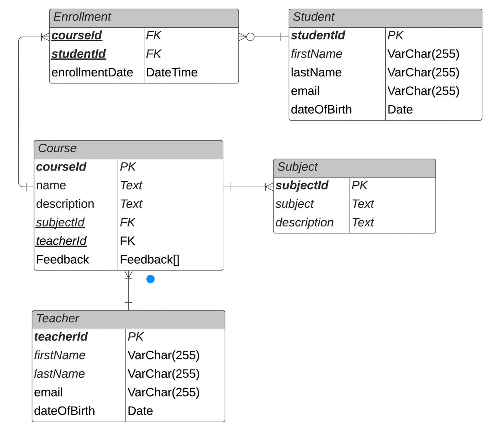

## Naming Convention

- Table names must be `singular`!
- Column : `snake_case`, or mixed case such as `student_ID`

## Create Table

```sql
CREATE TABLE <name> (
  <col1> TYPE [CONSTRAINT],
  table_constraint [CONSTRAINT]
) [INHERITS <existing_table>];
```

- Temporary tables
  - They are a type of table that exist in a special schema, so you cannot define a schema name when declaring a temporary table.
  - Use Temporary tables is because:
    - Temporary tables behave just like normal ones
    - Postgres will apply less “rules” (logging, transaction locking, etc.) to temporary tables so they execute more quickly
    - You have full access rights to the data, if you otherwise didn’t so you can test things out.

```sql
CREATE TEMPORARY TABLE <name> (<col1>);
```

## Constraints

### Column Constraint

| Constraint  | Meaning                                                                                                      |
| ----------- | ------------------------------------------------------------------------------------------------------------ |
| NOT NULL    | cannot be null                                                                                               |
| PRIMARY KEY | column will be the primary key                                                                               |
| UNIQUE      | can only contain unique values(NULL is Unique)                                                               |
| CHECK       | apply a special condition check against the values in the column                                             |
| REFERENCES  | constrain the values of the column to only be values that exist in the column of another table (Foreign Key) |

### Table Constraint

| Constraint                | Meaning                                         |
| ------------------------- | ----------------------------------------------- |
| UNIQUE (column_list)      | can only contain unique value (NULL is Unique)  |
| PRIMARY KEY (column_list) | columns that will be the primary key            |
| CHECK (condition)         | a condition to check when inserting or updating |
| REFERENCES                | Foreign key relationship to column              |

- Table constraint is defined at the bottom
- Every column constraint can be written as a table constraint
  - BEST PRACTICE: if constraint related to one column, write it as column constraint.
    if the constraint related to multiple columns, write it as table constraint.

```sql
CREATE TABLE student (
  strudent_id UUID PRIMARY KEY DEFAULT uuid_generate_v4(),
  first_name VARCHAR(255) NOT NULL,
  last_name VARCHAR(255) NOT NULL,
  email VARCHAR(255) NOT NULL,
  date_of_birth DATE NOT NULL,
  CONSTRAINT pk_student_id PRIMARY KEY (student_id)
);
```

## UUID

- install extension

```sql
CREATE EXTENSION IF NOT EXISTS "UUID-OSSP";
```

- get all extension

```sql
SELECT * FROM pg_available_extensions;
```

- UUID (Universally Unique Identifier) generate unique identifier for primary keys

- Pro

  - unique everywhere
  - easier to shard
  - easier to merge/replicate
  - expose less information about your system

- Con
  - larger values to store
  - can have performance impact
  - more difficult to debug

## Custom Data Types

- custom data types for Feedback
  

```sql
CREATE DOMAIN Rating SMALLINT
    CHECK (VALUE > 0 AND VALUE <= 5);

CREATE TYPE Feedback AS (
    student_id UUID,
    rating Rating,
    feedback TEXT
);
```

## ALTER TABLE

```sql
ALTER TABLE [ IF EXISTS ] [ ONLY ] name [ * ]
  ADD COLUMN <col> <type> <constraint>;

ALTER TABLE [ IF EXISTS ] [ ONLY ] name [ * ]
  ALTER COLUMN <name> TYPE <new type> [USING <expression>];

ALTER TABLE [ IF EXISTS ] [ ONLY ] name [ * ]
  RENAME COLUMN <old name> TO <new name>

ALTER TABLE [ IF EXISTS ] [ ONLY ] name [ * ]
  DROP COLUMN <col> TO [ RESTRICT | CASCADE ]
```

## Adding data (Insert)

```sql
INSERT INTO student(
  first_name,
  last_name,
  email,
  date_of_birth
) VALUES (
  'Mo',
  'Binni',
  'mo@binni.io',
  '1992-11-13'::DATE
);
```

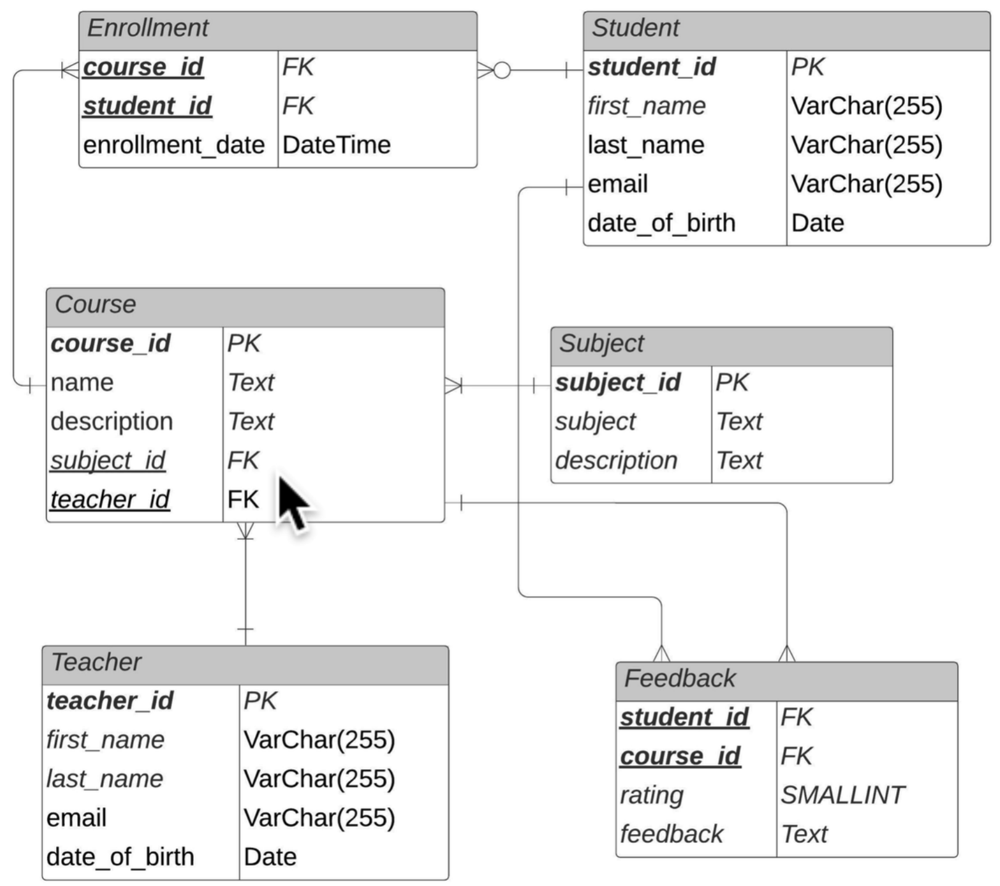

## Backups

### Backup Plans

1. What need to be backed up

- Full Backup : Backup all the data : less often
- Incremental : Backup since last incremental : often
- Differential : Backup since last full backup : often
- Transaction Log : Backup od the database transaction (real-time snapshot) : most frequent

2. Appropiate way to backup (OS, HDD, or only database)

3. How frequently?

4. Where to store backups

5. Retention Policy (How long to store?)

### Backup in PostgreSQL

- Create dump

### Restore in PostgreSQL

- LOad dump

## Transaction

- Transaction : Units of instruction
- Transaction keep thongs consistent

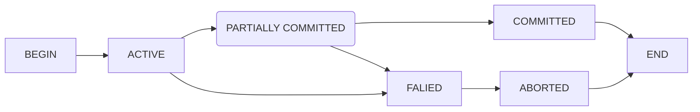
```mermaid
flowchart LR
    BEGIN-->ACTIVE
    ACTIVE-->id1(PARTIALLY COMMITTED)
    id1(PARTIALLY COMMITTED)-->FALIED
    ACTIVE-->FALIED
    id1(PARTIALLY COMMITTED)-->COMMITTED
    COMMITTED-->END
    FALIED-->ABORTED
    ABORTED-->END
```

```SQL
BEGIN;
DELETE FROM employees WHERE emp_no BETWEEN 10000 AND 10005; -- partially commit
SELECT * FROM employees;
ROLLBACK; -- not commit (ABORTED)
```

```SQL
BEGIN; -- locking databases
DELETE FROM employees WHERE emp_no BETWEEN 10000 AND 10005; -- partially commit
SELECT * FROM employees;
END; -- commit (COMMITTED)
```

- Transaction is to maintain the integrity of a database, all transactions must obey `ACID` properties

### ACID properties

- Atomicity: either execute entirely or not at all
- Consistency: each transaction should leave the database in a consistent state (COMMIT or ROLLBACK)
- Isolation: transaction should be executed in isolation from other transactions
- Duration: after completion of a transaction, the changes in the database should presist

# Database and System Design

## SDLC (Software Development Life Cycle)

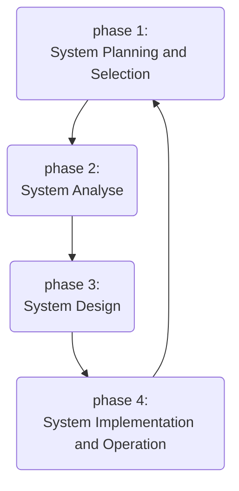
```mermaid
flowchart TB
    p1-->p2("phase 2:\nSystem Analyse")
    p2-->p3("phase 3:\nSystem Design")
    p3-->p4("phase 4:\nSystem Implementation and Operation")
    p4-->p1("phase 1:\nSystem Planning and Selection")
```

- The goal is robust systems!

- Process implementation: Agile, Waterfall, V-Model, ...

- **SDLC Phase 1** : Getting information on what needs to be done (scope)

- **SDLC Phase 2** : taking requirements and analyzing if it can be done on time and on budget

- **SDLC Phase 3** : designing the system architecture for all related components databases, apps, etc.

- **SDLC Phase 4** : building the software

- There are more phase: Testing, Maintenance

## System Design

- Phase 1 / 2 is more related to business stakeholders and architect at higher level

- Phase 3 / 4 is closer to implementation design and software program (more related to individual software engineer)

- System Design is all about creaing structure that can be understood and communicated

## Database Design

1. Top-Down
2. Bottom-Up

### Top-Down

- Start from 0
- Optimal choice when creating a new database
- All Requirements are gathered up-front

### Bottom-up

- There is an existing system or specific data in place
- Want to shape a new system aroud the existing data
- Optimal choice when migrating an existing database

### What to use?

- often we will use a bit of both top-down and bottom-up.

## DriveMe Academy

- Requirements

  - DriveMe is a driving school where people can take lessons based across the USA.
  - Every school has instrctors on payroll and an inventory of cars, truck and Motocycles for teaching.
  - Become a household name across the USA for learning how to drive.

  - Currently DriveMe has outdated website and their customer acquisition is mostly word of mouth.
  - They want to start gaining marketshare through an online presence

- Core Requirements
  - There is a vehicle inventory for students to rent
  - There are employees at every branch
  - There is maintenance for the vehicles
  - There is optional exam at the end of your lessons
  - You can only take the exam twice, if fail twice, you must take more lessons.

### Top-Down design

- Goal: to create a data model based on requirements

- Requirements:

  - high-level requirements
  - user interviews
  - data collection
  - deep understanding

- Method: ER Model

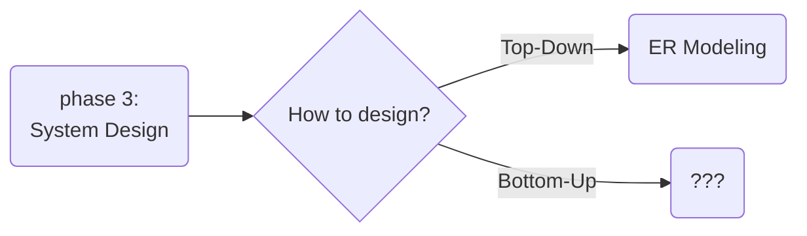
```mermaid
flowchart LR
    p3("phase 3:\nSystem Design")-->c1{"How to design?"}
    c1-->|Top-Down|c2("ER Modeling")
    c1-->|Bottom-Up|c3("???")
```

#### Step 1: Determining Entities

- What is an entity?

  - a person/place or thing
  - has a singular name
  - has an indentifier
  - should contain more than one instance of data

- DriveMe Entities: Student, School, Vehicle, Instructor, Maintenance, Exam, Lesson

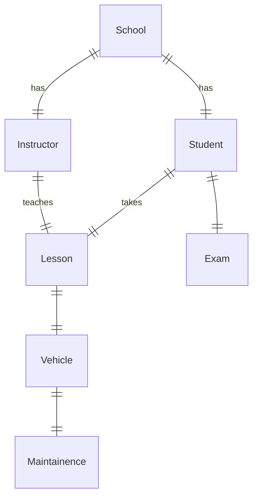
```mermaid
erDiagram
    School ||--|| Instructor : has
    School ||--|| Student : has
    Instructor ||--|| Lesson : teaches
    Student ||--|| Lesson : takes
    Student ||--|| Exam : ""
    Lesson ||--|| Vehicle : ""
    Vehicle  ||--|| Maintainence : ""
```

#### Step 2: Attributes

- Give entities the information they will store
- Must be property of the entity
- Must be atomic (smallest amount of data) e.g., address is not atomic it hold house number, street name, country etc.
- Single/Multivalued (Phone Number)
- Keys

#### Components in Relational Model

- Relation Schema : header of table
- Relation Instance : all of the rows of the table

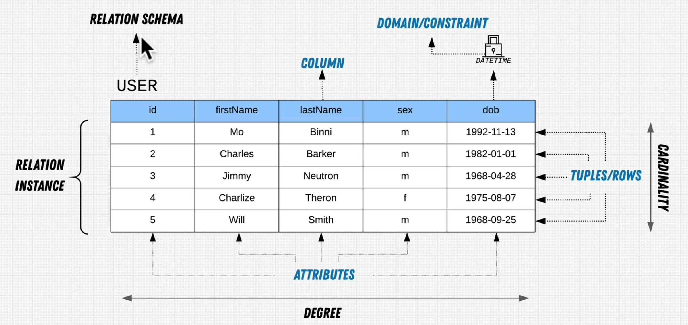

- `Relation Key`: uniquely identify the row and the relationship

  - `Super Key`: Combination of attribute that could uniquely identify rows. e.g., `id` & `firstName`
  - `Candidate Key`: Minimal anount of attribute that could uniquely identify rows. (Candidate Key is subset of Super Key)
  - `Primary key`: selected only one candidate key
  - `Foreign key`
  - `Compound key`: super key that include foreign key
  - `Composite key`: super key that **not** include foreign key
  - `Surrogate key`: a primary key that is not involve with individual data (synthetic primary key). it is generated.
  - `Alternate key`: is the secondary candidate key that contains all the property of a candidate key but is an alternate option.

- DriveMe Attributes

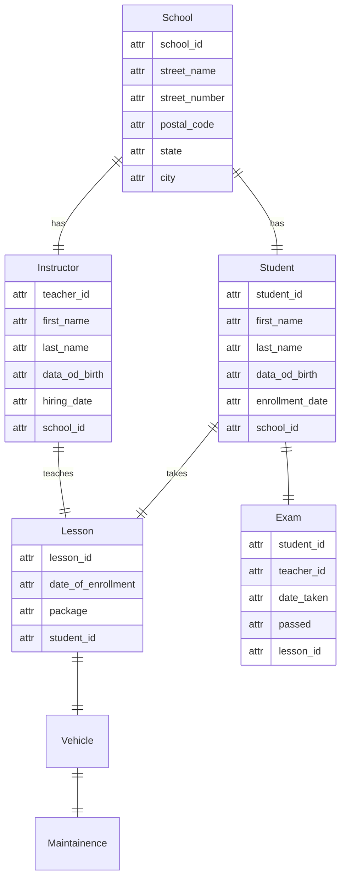
```mermaid
erDiagram
    %% Entity
    School {
      attr school_id
      attr street_name
      attr street_number
      attr postal_code
      attr state
      attr city
    }

    Instructor {
      attr teacher_id
      attr first_name
      attr last_name
      attr data_od_birth
      attr hiring_date
      attr school_id
    }

    Student {
      attr student_id
      attr first_name
      attr last_name
      attr data_od_birth
      attr enrollment_date
      attr school_id
    }

    Exam{
      attr student_id
      attr teacher_id
      attr date_taken
      attr passed
      attr lesson_id

    }

    Lesson{
      attr lesson_id
      attr date_of_enrollment
      attr package
      attr student_id

    }

    %% Relationship
    School ||--|| Instructor : has
    School ||--|| Student : has
    Instructor ||--|| Lesson : teaches
    Student ||--|| Lesson : takes
    Student ||--|| Exam : ""
    Lesson ||--|| Vehicle : ""
    Vehicle  ||--|| Maintainence : ""
```

#### Step 3: Relationships

- Determine the relationship between entities
- Links 2 entitiess together:
  - 1 to 1
  - 1 to many
  - many to many

```mermaid
erDiagram
  Entity |o--o| Zero-or-One : ""
  Entity ||--|| Exactly-One : ""
  Entity }o--o{ Zero-or-More : ""
  Entity }|--|{ One-or-More : ""
```

- format
  - first line: upper bound
  - second line: lower bound

```
<left-entity> <first-line><second-line>--<second-line><first-line> <right-entity>
```

- DriveMe Relationship

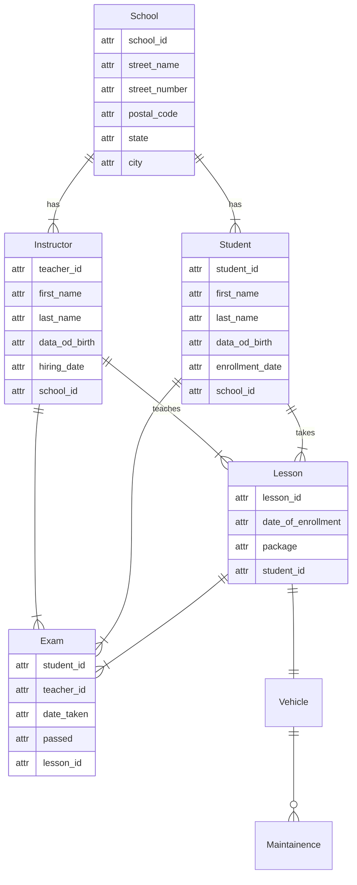
```mermaid
erDiagram
    %% Entity
    School {
      attr school_id
      attr street_name
      attr street_number
      attr postal_code
      attr state
      attr city
    }

    Instructor {
      attr teacher_id
      attr first_name
      attr last_name
      attr data_od_birth
      attr hiring_date
      attr school_id
    }

    Student {
      attr student_id
      attr first_name
      attr last_name
      attr data_od_birth
      attr enrollment_date
      attr school_id
    }

    Exam{
      attr student_id
      attr teacher_id
      attr date_taken
      attr passed
      attr lesson_id

    }

    Lesson{
      attr lesson_id
      attr date_of_enrollment
      attr package
      attr student_id

    }

    %% Relationship
    School ||--|{ Instructor : has
    School ||--|{ Student : has
    Instructor ||--|{ Exam : ""
    Instructor ||--|{ Lesson : teaches
    Student ||--|{ Lesson : takes
    Student ||--|{ Exam : ""
    Lesson ||--|{ Exam : ""
    Lesson ||--|| Vehicle : ""
    Vehicle  ||--o{ Maintainence : ""
```

#### Step 4: Solving Many to Many Relationship

- In relational model, it is impossible to store many to many relationship

- techinically possible but will lead to more over head: insert overhead, update overhead, delete overhead, potential redundancy

- Rule of Thumb: Always try to resolve many to many


```mermaid
erDiagram
  Book }|--|{ Author : ""
```

- Add intermediate entities (intermediate table)

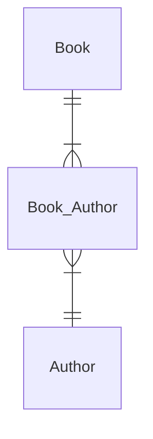
```mermaid
erDiagram
  Book ||--|{ Book_Author : ""
  Book_Author }|--|| Author : ""
```

#### Step 5: Subject Area

- Divide entities into logical groups that are related (think schemas)

- This step is need for distributed level at a global level

- Subject Area Rules:

  - All entities must belong to one subject area
  - An entity can only belong to one
  - You can nest subject areas

- DriveMe Subject Area

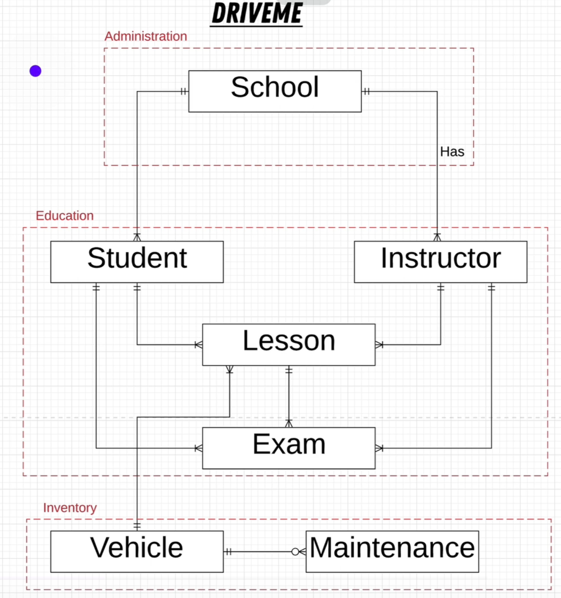

#### Exercise: Patining Reservation

- a rich business man has tons of paintings.
- he want to build a system to catalog and track where his art is
- he lends it to museums all across the world
- he want to see reservations
- some constraints:

  - a painting can only have one artist

- ask about the system.

  - goal?
    - tracj painting reservation for a wealthy man
  - stakeholders?
    - owner, museums

- step 1: entities

  - painting
  - reservation
  - museum
  - artist

- step 2: attributes
  | Entities | Attributes |
  |-------------|---------------------------------------------|
  | Painting | name, creation_date, style |
  | Reservation | creation_date, date_from, date_to, accepted |
  | Artist | name, birth_date, email |
  | Museum | name, address, phone_number, email |

- step 3: relationships

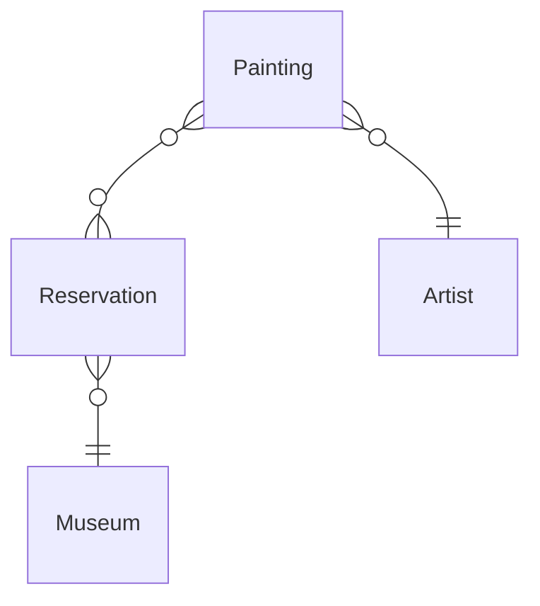
```mermaid
erDiagram
  Painting }o--o{ Reservation : ""
  Painting }o--|| Artist : ""
  Reservation }o--|| Museum : ""
```

- step 4: solving many to many

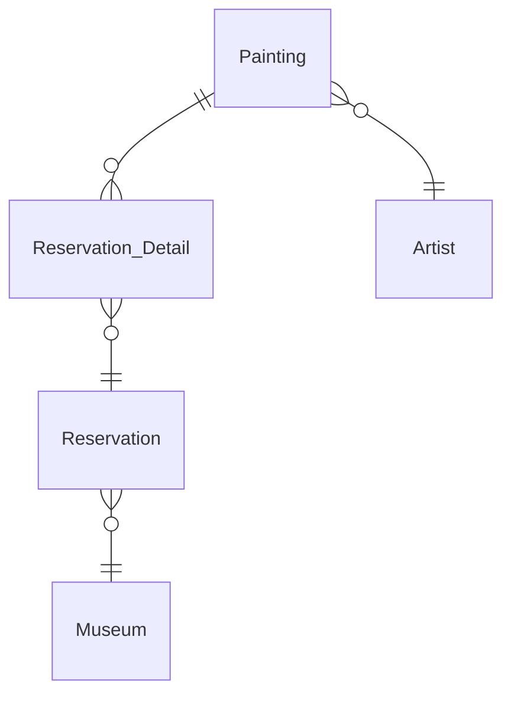
```mermaid
erDiagram
  Painting ||--o{ Reservation_Detail : ""
  Reservation_Detail }o--|| Reservation : ""
  Painting }o--|| Artist : ""
  Reservation }o--|| Museum : ""
```

#### Exercise: Cinema

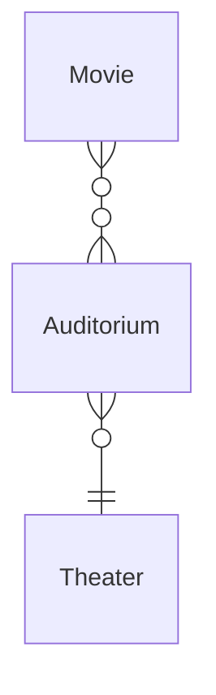
```mermaid
erDiagram
  Movie }o--o{ Auditorium : ""
  Auditorium }o--|| Theater : ""
```

- fix many to many

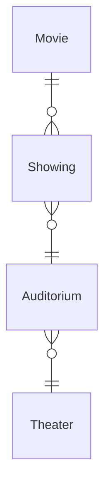
```mermaid
erDiagram
  Movie ||--o{ Showing : ""
  Showing }o--|| Auditorium : ""
  Auditorium }o--|| Theater : ""
```

### Bottom Up Design

- create a data model from specific detail, existing systems, legacy systems

1. indentify the data (attributes)
2. group them (entities)

- create a perfact data model without `redundancy` and `anomalies`

#### Anomalies

- incorrected structure database
- 3 types:
  1. update anomalies
  2. insert anomalies
  3. delete anomalies

1. update anomalies

- ensure the changes apply to all related data
  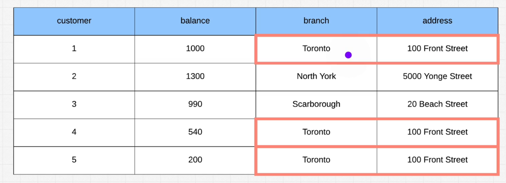
  From this table, if Toronto brach changes the address, we need to update the same thing on many rows.

2. insert anomalies

- check that data is consistency
  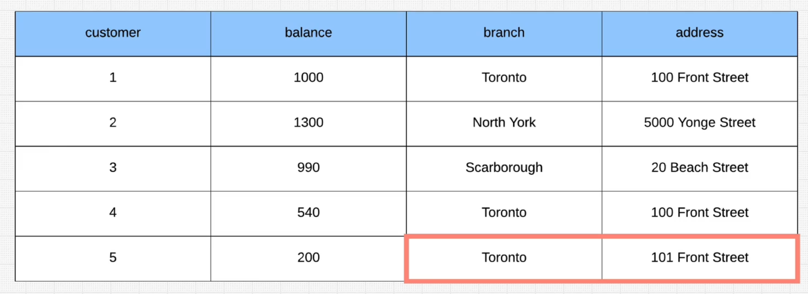
  From this table, if someone insert customer id 5 with wrong address of the branch, it will cause inconsistency

3. delete anomalies

- ensure that we do not lose important data
  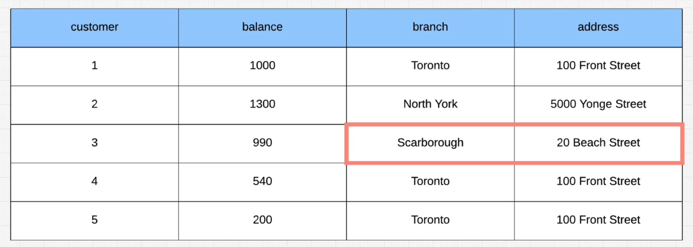
  From this table, if we delete customer id 3, we will lose data of Scarborough branch.

- Normalized : avoiding anomalies is key to database design
  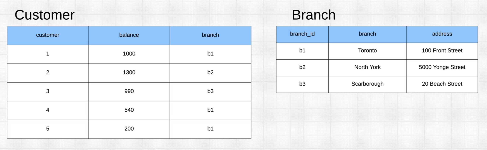

#### Normalization

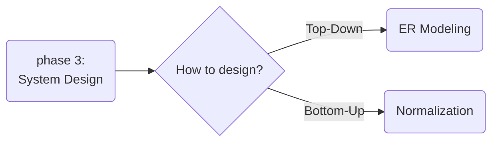
```mermaid
flowchart LR
    p3("phase 3:\nSystem Design")-->c1{"How to design?"}
    c1-->|Top-Down|c2("ER Modeling")
    c1-->|Bottom-Up|c3("Normalization")
```

1. functional dependencies

2. normal forms

##### Functional Dependencies

- functional dependency shows a relationship between attributes.

- functional dependency exists when a relationship between two attributes allows you to uniquely determine the corresponding attribute's value

- `B` --> `A` : `A` is functional dependent on `B` when a value of `B` determines a value of `A`
  - `determinant` --> `dependate`
  - `branch_id` --> `branch_assress`
  - `student_id` --> `birth_date`
  - `employee_id` --> `first_name`

##### Normal Form

- Normalizarion happens through a process of running attributes through the normal forms

- `0NF` -> `1NF` -> `2NF` -> `BCBF` -> `4NF` -> `5NF` -> `6NF`

- each normal form aims to furthur separate relationships into smaller instances as to create less redundancy and anomalies!

- BCNF (Boyce-Codd Normal Form) or 3.5NF

- 0NF to BCNF are the most common normal form

- 4NF to 6NF is too extreme

##### 0NF

- data that unnormalized:
  1. repeating groups of fields
  2. positional dependence of data
  3. non-atomic data

##### 1NF

1. eliminate repeating columns of the same data
2. each attribute should contain a single value
3. determine a primary key

- example `0NF`
  | color | quantity | price |
  | ---------------------- | -------- | ----- |
  | red, green, blue | 20 | 9.99 |
  | yellow, orange, purple | 10 | 10.99 |
  | blue, cyan | 15 | 3.99 |
  | green, magento | 200 | 15.99 |

- normalization to `1NF`
  | 0NF | 1NF |
  | -------- | ------------------------- |
  | color | **table: PRODUCT** |
  | quantity | <u>prod_id</u> \<PK> |
  | price | quantity |
  | | price |
  | | <br/> |
  | | **table: PRODUCT_COLOUR** |
  | | <u>prod_id</u> \<FK> |
  | | color |

##### 2NF

1. data need to come from `1NF`
2. all non-key attributes are fully functional dependent on the primary key

- example `0NF`
  | Book | Author1 | Author2 | Author3 |
  |------|---------|---------|---------|
  | 1 | 1 | 2 | 3 |
  | 2 | 2 | 2 | 3 |
  | 3 | 3 | 2 | 1 |

- normalization to `2NF`

| 0NF    | 1NF                    | 2NF                    |
| ------ | ---------------------- | ---------------------- |
| book   | **table: BOOK**        | **table: BOOK**        |
| author | <u>book_id</u> \<PK>   | <u>book_id</u> \<PK>   |
|        | title                  | title                  |
| <br/>  |                        |                        |
|        | **table: BOOK_AUTHOR** | **table: BOOK_AUTHOR** |
|        | <u>book_id</u> \<FK>   | <u>book_id</u> \<FK>   |
|        | author_id              | <u>author_id</u> \<FK> |
|        | author_name            |                        |
|        | author_address         | **table: AUTHOR**      |
|        | author_email           | <u>author_id</u> \<PK> |
|        |                        | <u>author_id</u>       |
|        |                        | author_name            |
|        |                        | author_address         |
|        |                        | author_email           |

##### 3NF

1. data need to come from `2NF`
2. no transitive dependencies

- `Transitive Dependency`: is `A` functionally dependent on `B`, and `B` is functionally dependent on `C`. A is transitively dependent on C via B.

  - `B -> A`, `C -> B`. Thus, `A ~> C`

- normalization to `3NF`

| 0NF        | 1NF                 | 2NF                    | 3NF                      |
| ---------- | ------------------- | ---------------------- | ------------------------ |
| branch     | **table: EMPLOYEE** | **table: EMPLOYEE**    | **table: EMPLOYEE**      |
| first name | first_name          | <u>emp_no</u> \<PK>    | <u>emp_no</u> \<PK>      |
| last name  | last_name           | first_name             | first_name               |
| title      | title               | last_name              | last_name                |
| hours      | <u>emp_no</u>       | title                  | title                    |
| <br/>      |                     |                        |                          |
|            | **table: BRANCH**   | **table: BRANCH**      | **table: BRANCH**        |
|            | street              | <u>branch_no</u> \<PK> | <u>branch_no</u> \<PK>   |
|            | street_no           | street                 | street                   |
|            | province            | street_no              | street_no                |
|            | postal_code         | province               | <u>province_id</u> \<FK> |
|            | <u>branch_no</u>    | postal_code            | postal_code              |
|            | <u>emp_no</u>       | country                |                          |
|            | hours_logged        |                        | **table: TIMESHEET**     |
|            | country             | **table: TIMESHEET**   | <u>branch_no</u> \<FK>   |
|            |                     | <u>branch_no</u> \<FK> | <u>emp_no</u> \<FK>      |
|            |                     | <u>emp_no</u> \<FK>    | hours_logged             |
|            |                     | hours_logged           |                          |
|            |                     |                        | **table: PROVINCE**      |
|            |                     |                        | <u>province_id</u> \<PK> |
|            |                     |                        | country                  |
|            |                     |                        | province                 |

- though on table `BRANCH` from `2NF` tp `3NF`
  - branch_no -> province
  - province -> country
  - branch_no ~> country

##### BCNF

1. data need to come from `3NF`
2. for any dependency `A -> B`. `A` should be a super key

- most relationships on `3NF` are also on BCNF but not all of them!
- `3NF` allows attributes to be part of a `candidate key` that is not the `primary key` - `BCNF` does not

- A relationship is not in BCNF if:

  1. the primary key is a composite key
  2. there is more than one candidate key
  3. some attributes have keys in common

- example

| student_id | tutor_id | tutor_national_id |
| ---------- | -------- | ----------------- |
| 1          | 999      | 838 383 494       |
| 2          | 234      | 343 535 352       |
| 3          | 999      | 838 383 494       |
| 4          | 1234     | 354 464 234       |

- candidate:

  - [student_id, tutor_id]
  - [student_id, tutor_sin]

- functionally dependent

  - tutor_id -> tutor_sin
  - tutor_sin -> tutor_id
  - [student_id, tutor_id] -> tutor_sin
  - [student_id, tutor_sin] -> tutor_id

- normalization to BCNF

| student_id | tutor_id |
| ---------- | -------- |
| 1          | 999      |
| 2          | 234      |
| 3          | 999      |
| 4          | 1234     |

| tutor_id | tutor_national_id |
| -------- | ----------------- |
| 999      | 838 383 494       |
| 234      | 343 535 352       |
| 1234     | 354 464 234       |

# 4NF / 5 NF

- 4NF and 5NF are not generally used
- may results in over-normalization
